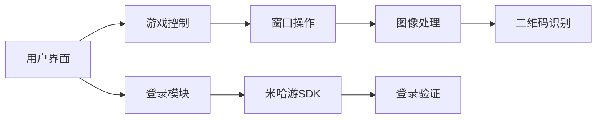

# BBH3ScanLaunch
一个B服崩坏三扫码和一键登录工具，源码源自 https://github.com/HonkaiScanner/scannerHelper-memories ，鸣谢[Hao_cen@bilibili](https://space.bilibili.com/269140934?spm_id_from=333.1387)

## 功能特点
- **B站账号登录**：首次手动登陆后可缓存登陆信息
- **快捷启动游戏**：配置游戏可执行文件路径 "BH3.exe" 后可快捷打开崩坏3或一键登陆崩坏三（均需管理员权限）
- **解析二维码**：功能与手机端B服崩坏3扫码功能相同
- **可选自动截屏**：检测到崩坏3窗口后，自动截取窗口内容，即使其不在前台
- **可选自动退出**：扫码完成后自动退出扫码器，避免资源占用
- **可选自动点击**：开启后可实现自动点击屏幕，切换登陆模式为扫码模式、刷新过期二维码（需要管理员权限）
- **多分辨率支持**：自适应不同屏幕分辨率的模板匹配，也支持自行剪裁、按命名规则添加素材
- **图形用户界面**：用QT6构建的简洁直观的操作面板，能依据系统主题自动以暗色、亮色模式启动
- **接收命令行参数**：使用参数 --auto-login 时，会自动触发一键登录流程（编译后版本中自带了这一快捷方式）
- **跨版本支持**：当"oa_token.json" 不存在或过期时，自动从 [jsdelivr](https://cdn.jsdelivr.net/gh/LoveElysia1314/BBH3ScanLaunch@main/oa_token.json) 获取文件。从而实现oa_token随版本更新而无需更新代码或程序。

## 安装与使用

### 1. 使用源码

#### 环境要求
- **操作系统**：Windows 10/11
- **Python版本**：3.10+
- **依赖库**：
  ```
  flask
  PySide6
  opencv-python-headless
  numpy
  pillow
  pyautogui
  pyzbar
  pywin32
  cryptography
  requests
  ```

#### 安装步骤
1. 克隆仓库：
   ```bash
   git clone https://github.com/LoveElysia1314/BBH3ScanLaunch.git
   cd BBH3ScanLaunch
   ```
2. 创建虚拟环境：
   ```bash
   python -m venv venv
   venv\Scripts\activate
   ```
3. 安装依赖：
   ```bash
   pip install -r requirements.txt
   ```

### 2. 从源码编译

1. 克隆仓库：
   ```bash
   git clone https://github.com/LoveElysia1314/BBH3ScanLaunch.git
   cd BBH3ScanLaunch
   ```
2. 安装pyinstaller：
   ```bash
   pip install pyinstaller
   ```

3. 打包为可执行文件
```bash
python build.py
```
- 输出位置：`dist/`目录
- 包含两个快捷方式：
  - `[仅B服] 崩坏3扫码器.lnk`：标准模式
  - `[仅B服] 一键登陆崩坏3.lnk`：全自动模式

### 使用说明
1. **首次配置**：
   - 运行程序后点击"登陆账号"输入B站账号密码
   - 点击"配置游戏路径"选择`BH3.exe`文件
   - 推荐路径：`C:\miHoYo Launcher\games\Honkai Impact 3rd Game\BH3.exe`

2. **功能开关**：
   - `解析二维码`：读取剪贴板中的登录码
   - `自动截屏`：后台监控游戏窗口
   - `自动退出`：扫码成功后自动关闭程序
   - `自动点击`：自动切换登录方式并确认

3. **一键登录**：
   - 点击"一键登陆崩坏3"启动全自动流程：
     1. 自动启动游戏
     2. 后台监控扫码
     3. 自动点击确认
     4. 完成后自动退出


## 技术实现
### 核心模块
| 模块 | 功能 |
|------|------|
| `main.py` | 主程序入口，GUI事件处理 |
| `mainWindow.py` | PySide6界面实现 |
| `bh3_utils.py` | 图像处理/窗口操作核心 |
| `mihoyosdk.py` | 米哈游登录接口封装 |
| `build.py` | 自动化构建脚本 |

### 架构图


## 注意事项
1. **管理员权限**：
   - 自动截屏/点击功能需要管理员权限运行
   - 首次使用需右键"以管理员身份运行"

2. **游戏版本**：
   - 当前脚本通过访问github上的 "oa_token.json" 实现崩坏三多版本支持，但由于CDN服务器可能存在的更新不及时问题，每个版本初可能不能及时更新oa_token，请耐心等待一段时间

3. **分辨率适配**：
   - 非文本控件（包括切换扫码模式和刷新二维码）支持绝大部分分辨率
   - 文本控件（包括“确定”控件）支持3200x2000 PC屏幕和2800x1260 手机屏幕，其他分辨率需添加对应模板到`Pictures_to_Match/`，命名规则为屏幕高度+编号，禁止出现中文。如"4000p_1.png"代表屏幕高度4000下截的图，编号为1

## 常见问题
**Q：“自动点击”功能无效？**  
A：请确保以管理员权限运行

**Q：一键登录模式异常？**  
A：检查游戏路径配置是否正确，常见错误是选择了"崩坏3"而不是"BH3.exe"导致打开的是米哈游启动器而非崩淮3本体。

## 贡献指南
欢迎提交Pull Request，请确保：
1. 遵循现有代码风格
2. 更新相关文档
3. 通过基础功能测试

## 许可证
[GPLv3 License](./LICENSE)
