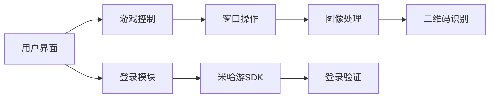

# BBH3ScanLaunch
一个B服崩坏三扫码和一键登录工具

## 功能特点
- **B站账号登录**：支持账号密码登录和缓存登录
- **崩坏3自动扫码**：后台识别游戏窗口中的二维码
- **一键登录模式**：自动启动游戏+扫码+登录全流程
- **智能窗口操作**：自动点击游戏窗口中心位置
- **多分辨率支持**：自适应不同屏幕分辨率的模板匹配
- **图形用户界面**：简洁直观的操作面板

## 安装与使用

### 环境要求
- **操作系统**：Windows 10/11
- **Python版本**：3.7+
- **依赖库**：
  ```
  flask
  PySide6
  opencv-python-headless
  numpy
  pillow
  pyautogui
  pyzbar
  pywin32
  cryptography
  requests
  ```

### 安装步骤
1. 克隆仓库：
   ```bash
   git clone https://github.com/LoveElysia1314/BBH3ScanLaunch.git
   cd BBH3ScanLaunch
   ```
2. 创建虚拟环境：
   ```bash
   python -m venv venv
   venv\Scripts\activate
   ```
3. 安装依赖：
   ```bash
   pip install -r requirements.txt
   ```

### 使用说明
1. **首次配置**：
   - 运行程序后点击"登陆账号"输入B站账号密码
   - 点击"配置游戏路径"选择`BH3.exe`文件
   - 推荐路径：`C:\miHoYo Launcher\games\Honkai Impact 3rd Game\BH3.exe`

2. **功能开关**：
   - `解析二维码`：读取剪贴板中的登录码
   - `自动截屏`：后台监控游戏窗口
   - `自动退出`：扫码成功后自动关闭程序
   - `自动点击`：自动切换登录方式并确认

3. **一键登录**：
   - 点击"一键登陆崩坏3"启动全自动流程：
     1. 自动启动游戏
     2. 后台监控扫码
     3. 自动点击确认
     4. 完成后自动退出

## 构建说明
### 打包为可执行文件
```bash
python build.py
```
- 输出位置：`dist/`目录
- 包含两个快捷方式：
  - `[仅B服] 崩坏3扫码器 [限v8.3].lnk`：标准模式
  - `[仅B服] 一键登陆崩坏3 [限v8.3].lnk`：全自动模式

### 自定义构建选项
编辑`build.py`：
```python
USE_ONEFILE = True  # 单文件模式
```

## 技术实现
### 核心模块
| 模块 | 功能 |
|------|------|
| `main.py` | 主程序入口，GUI事件处理 |
| `mainWindow.py` | PySide6界面实现 |
| `bh3_utils.py` | 图像处理/窗口操作核心 |
| `mihoyosdk.py` | 米哈游登录接口封装 |
| `build.py` | 自动化构建脚本 |

### 架构图


## 注意事项
1. **管理员权限**：
   - 自动截屏/点击功能需要管理员权限运行
   - 首次使用需右键"以管理员身份运行"

2. **游戏版本**：
   - 当前仅支持崩坏3 v8.3版本
   - 游戏更新后可能需要调整模板图片

3. **分辨率适配**：
   - 支持主流分辨率：1260p/1440p/2160p
   - 自定义分辨率需添加对应模板到`Pictures_to_Match/`

## 常见问题
**Q：“自动点击”功能无效？**  
A：请确保以管理员权限运行

**Q：无法识别游戏窗口？**  
A：确认游戏窗口标题为"崩坏3"，可在`bh3_utils.py`中修改：
```python
GAME_WINDOW_TITLE = "崩坏3"  # 修改为实际窗口标题
```

**Q：一键登录模式异常？**  
A：检查游戏路径配置是否正确，日志中会显示具体错误信息

## 贡献指南
欢迎提交Pull Request，请确保：
1. 遵循现有代码风格
2. 更新相关文档
3. 通过基础功能测试

## 许可证
[MIT License](LICENSE)
