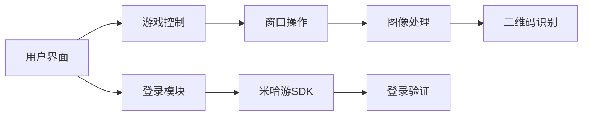

# BBH3ScanLaunch
一个用于B服崩坏三扫码和一键登录的工具，旨在简化登录流程并提供自动化功能。项目源码源自 [scannerHelper-memories](https://github.com/HonkaiScanner/scannerHelper-memories)，特别鸣谢[Hao_cen@bilibili](https://space.bilibili.com/269140934?spm_id_from=333.1387)。

## 功能特点
- **B站账号登录**：首次手动登录后可缓存登录信息，后续快速登录。
- **快捷启动游戏**：配置游戏可执行文件路径 "BH3.exe" 后，可快捷打开崩坏3或一键登录（需管理员权限）。
- **二维码解析**：功能与手机端B服崩坏3扫码功能相同。
- **自动化功能**：
  - 自动截屏：后台监控游戏窗口，自动截取内容。
  - 自动退出：扫码完成后自动退出程序，避免资源占用。
  - 自动点击：自动切换登录模式并确认（需管理员权限）。
- **多分辨率支持**：支持不同屏幕分辨率的模板匹配，用户可自行添加素材。
- **图形用户界面**：基于 PySide6 构建，支持暗色和亮色模式。
- **命令行参数支持**：通过 `--auto-login` 参数触发一键登录流程。
- **跨版本支持**：自动从远程获取 `oa_token.json` 文件，确保兼容性。

## 安装与使用

### 环境要求
- **操作系统**：Windows 10/11
- **Python版本**：3.10+
- **依赖库**：详见 `requirements.txt` 文件。

### 使用源码
1. 克隆仓库：
   ```bash
   git clone https://github.com/LoveElysia1314/BBH3ScanLaunch.git
   cd BBH3ScanLaunch
   ```
2. 创建虚拟环境并安装依赖：
   ```bash
   python -m venv venv
   venv\Scripts\activate
   pip install -r requirements.txt
   ```
3. 运行程序：
   ```bash
   python run.py
   ```

### 从源码编译
1. 安装 `pyinstaller`：
   ```bash
   pip install pyinstaller
   ```
2. 打包为可执行文件：
   ```bash
   python scripts/build.py
   ```
   - 输出位置：`dist/` 目录。
   - 包含快捷方式：
     - `[仅B服] 崩坏3扫码器.lnk`：标准模式。
     - `[仅B服] 一键登录崩坏3.lnk`：全自动模式。

### 使用说明
1. **首次配置**：
   - 运行程序后点击“登录账号”输入B站账号密码。
   - 点击“配置游戏路径”选择 `BH3.exe` 文件。
   - 推荐路径：`C:\miHoYo Launcher\games\Honkai Impact 3rd Game\BH3.exe`。

2. **功能开关**：
   - `解析二维码`：读取剪贴板中的登录码。
   - `自动截屏`：后台监控游戏窗口。
   - `自动退出`：扫码成功后自动关闭程序。
   - `自动点击`：自动切换登录方式并确认。

3. **一键登录**：
   - 点击“一键登录崩坏3”启动全自动流程：
     1. 自动启动游戏。
     2. 后台监控扫码。
     3. 自动点击确认。
     4. 完成后自动退出。

## 技术实现
### 项目结构
```
BBH3ScanLaunch/
├── src/
│   └── bbh3_scan_launch/
│       ├── __init__.py
│       ├── main.py                    # 主程序入口，GUI事件处理
│       ├── gui/
│       │   ├── __init__.py
│       │   └── main_window.py         # PySide6界面实现
│       ├── core/
│       │   ├── __init__.py
│       │   ├── bh3_utils.py           # 图像处理/窗口操作核心
│       │   └── sdk/
│       │       ├── __init__.py
│       │       ├── mihoyosdk.py       # 米哈游登录接口封装
│       │       └── bsgamesdk.py       # B站登录接口封装
│       └── utils/
│           ├── __init__.py
│           ├── config_utils.py        # 配置管理
│           ├── network_utils.py       # 网络工具
│           ├── version_utils.py       # 版本管理
│           └── utils.py               # 通用工具
├── resources/                        # 资源文件
│   ├── pictures_to_match/            # 模板图片
│   └── templates/                    # HTML模板
├── config/                           # 配置文件
│   └── config.json
├── scripts/                          # 构建脚本
│   ├── build.py
│   └── build_installer.py
├── tests/                            # 测试文件
├── updates/                             # 文档
├── run.py                            # 主入口文件
└── requirements.txt
```

### 核心模块
| `mihoyosdk.py` | 米哈游登录接口封装 |
| `build.py` | 自动化构建脚本 |

### 架构图


## 注意事项
1. **管理员权限**：
   - 自动截屏/点击功能需要管理员权限运行。
   - 首次使用需右键“以管理员身份运行”。

2. **游戏版本**：
   - 当前脚本通过访问远程 `oa_token.json` 实现多版本支持，但可能存在更新延迟问题，请耐心等待。

3. **分辨率适配**：
   - 支持绝大部分分辨率，其他分辨率需添加模板到 `Pictures_to_Match/`，命名规则为屏幕高度+编号。

## 常见问题
**Q：“自动点击”功能无效？**  
A：请确保以管理员权限运行。

**Q：一键登录模式异常？**  
A：检查游戏路径配置是否正确，确保选择的是 `BH3.exe` 文件。

## 贡献指南
欢迎提交 Pull Request，请确保：
1. 遵循现有代码风格。
2. 更新相关文档。
3. 通过基础功能测试。

## 更新日志
查看完整更新日志：[changelog.txt](./updates/changelog.txt)

## 许可证
[GPLv3 License](./LICENSE)
